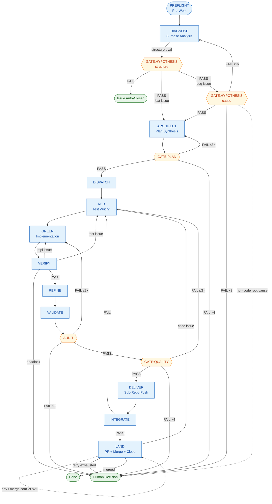

# AutoFlow Guide — Phase-by-Phase Development Lifecycle

> AutoFlow is a structured, evaluation-gated development lifecycle for AI-assisted
> software engineering with Claude Code. This guide is the **phase-body source of
> truth**: each phase's step-by-step procedure, scoring rubric, and `[MUST]`/`[DENY]`
> constraints live here. The cross-phase invariants, the router (phase list + Flow
> Control table), the regression / escalation caps, the Execution Principles, and the
> state schema live in [`CLAUDE.md`](../CLAUDE.md); the DIAGNOSE analysis procedure has
> its own playbook at [`phases/analysis.md`](phases/analysis.md).

---

## Overview

AutoFlow defines 16 phases (`PREFLIGHT` → `LAND`) that guide every code change
from issue analysis to merge. Each phase has explicit entry/exit criteria, and
evaluation gates prevent low-quality work from reaching production.

Key principles:

- **No shortcuts** — every phase is executed in order.
- **Multi-agent separation** — distinct roles handle implementation, testing, and evaluation.
- **Bias prevention** — 3-phase independent analysis before coding.
- **Quantified quality** — 10-point evaluation with a defined PASS threshold.
- **Per-phase model selection** — teammate and subagent spawns use the recommended model per phase (`sonnet` for rubric-scored gates and classification work; `opus` for multi-turn design discussion, implementation, and self-check). Policy and table: [`CLAUDE.md`](../CLAUDE.md) > Spawn Model — Phase-by-Phase.

The phase names generalize upstream's numeric `STEP 0~9` identifiers; the
mapping is preserved 1:1 below.

| upstream | this guide |
|----------|------------|
| STEP 0 | PREFLIGHT |
| STEP 1 | DIAGNOSE |
| STEP 1.5 | GATE:HYPOTHESIS |
| STEP 2 | ARCHITECT |
| STEP 3 | GATE:PLAN |
| STEP 4 | DISPATCH |
| STEP 5a | RED |
| STEP 5b | GREEN |
| STEP 5c | VERIFY |
| STEP 5d | REFINE |
| STEP 5.5 | VALIDATE |
| STEP 5.7 | AUDIT |
| STEP 6 | GATE:QUALITY |
| STEP 7 | DELIVER |
| STEP 8 | INTEGRATE |
| STEP 9 | LAND |

---

## Lifecycle Diagram

The full AutoFlow lifecycle, including regression paths and gate verdicts.
Diamond nodes are evaluation gates; stadium nodes are terminal states.



The same diagram in plain text, for environments without mermaid rendering:

```
PREFLIGHT
    │
    ▼
DIAGNOSE ─── structure eval ──► [FAIL] → Issue Auto-Closed
    │
    ▼
GATE:HYPOTHESIS (cause, bug only) ◄── retry ≤2×
    │
    ▼
ARCHITECT ◄── retry ≤3×
    │
    ▼
GATE:PLAN
    │
    ▼
DISPATCH → RED → GREEN ⇄ VERIFY (≤3 round-trips) → REFINE
                                                       │
                                                       ▼
                                                   VALIDATE
                                                       │
                                                       ▼
                                                    AUDIT  ◄── retry ≤2×
                                                       │
                                                       ▼
                                                GATE:QUALITY ◄── retry ≤3× → RED
                                                       │
                                                       ▼
                                                    DELIVER
                                                       │
                                                       ▼
                                                   INTEGRATE → [FAIL] → RED
                                                       │
                                                       ▼
                                                     LAND ◄── retry ≤2×
                                                       │
                                                       ▼
                                                     Done
```

---

## PREFLIGHT — Pre-Work

**Goal**: ensure a clean Git state before any analysis or coding begins.

| Step | Action |
|------|--------|
| 1 | `git status` — confirm no uncommitted changes or untracked files in the working area |
| 2 | `git fetch origin` — sync with remote |
| 3 | Resolve any dirty state (stash, commit, or discard with user approval) |
| 4 | `git checkout -b dev/YYYY-MM-DD main` — create a dev branch |

**Hard stop**: if the Git state is not clean after resolution attempts, **stop and report to the user**. Do NOT proceed to DIAGNOSE.

---

## DIAGNOSE — Issue Analysis

→ **Phase playbook (single source of truth): [`phases/analysis.md`](phases/analysis.md).**
Read it on entering DIAGNOSE. It carries the full procedure: the **intake readiness triage**
(`mode=new-issue` only, run ahead of the structure fan-out — a planning/design/ADR pre-req
filter that pauses for the user on FAIL, no auto issue creation), the 3-Phase independent
structure analysis (Phase A structure-only, Phase B issue-only, Phase 3 necessity scoring),
**the per-role document injection whitelist (three distinct roles — Phase A = current-state
area excerpts only; intake triage = issue body + readiness/work-type docs; Phase B = issue
body only)**, the issue-type classification (Type 1 code / Type 2 docs), the per-type scoring rubric and
PASS/FAIL thresholds (Type 1: each ≥ 7, two items; Type 2: each ≥ 7 and avg ≥ 7.5, three
items), the FAIL disposition by failing item and cycle `mode` (gap-low → new-issue close /
review-response reply on PR; non-code lever → report to user + pause), the review-response loop check (trigger repeats the prior cycle's complaint class with a new witness case → reply on PR + pause for the user), cause hypotheses
(≥ 3, "not a code bug" must be one), lightweight verification, hypothesis verdict notes,
task decomposition, affected-docs identification, and the structure- and confirmation-bias
safeguards.

---

## GATE:HYPOTHESIS — Hypothesis Evaluation (bug/incident issues only)

Feat issues skip this gate.

**Evaluator**: independent Evaluation AI, fresh-spawned per call.
**Input**: hypothesis list + lightweight-verification results + verdict notes.

### Scoring (3 items × 10 points)

| Item | Criterion |
|------|-----------|
| Hypothesis diversity | Are non-code causes (data, environment, already-fixed) sufficiently considered? |
| Verification sufficiency | Was lightweight verification actually performed? Are unverified items justified? |
| Verdict evidence | Is the conclusion (code change required / not required) logically supported? |

- **PASS** → ARCHITECT.
- **FAIL** → DIAGNOSE (max 2×). Two FAILs → human decision.
- **Non-code root cause confirmed** → report to user, pause AutoFlow.

---

## ARCHITECT — Plan Synthesis (Developer AI + Test AI)

Both perspectives participate, but the discussion runs inside an isolated
**`Workflow`** (the facilitator — `architect-deliberation`), **not** as Agent-Teams
teammates messaging the orchestrator: the Developer-AI and Test-AI run as in-script
sub-agents, their cross-talk stays in workflow variables, and only a single verdict
(`CONVERGED` + artifact paths, or `ESCALATE` at the 6-round cap) returns to the
orchestrator. The facilitator also appends the settled decisions to the decision
ledger. Rationale: [`CLAUDE.md`](../CLAUDE.md#deliberation-isolation-delegated-facilitation)
> Deliberation Isolation; contract: [`teammate-contracts.md`](teammate-contracts.md)
> Facilitator. The orchestrator invokes the facilitation workflow, then **verifies** the
returned verdict — spot-checking targeted artifact excerpts against re-derived facts (the
full read-and-score is GATE:PLAN's); it does not facilitate the discussion turn-by-turn and
does not receive the round-by-round messages.

**Document injection (ARCHITECT onward).** Past DIAGNOSE the Phase A ↔ Phase B isolation no longer applies — the Developer-AI and Test-AI both work from code and design together. Injection is still **role-minimal and routed via [`docs/INDEX.md`](INDEX.md)**, never wholesale: the facilitator passes each in-script sub-agent only the documents its design task needs (e.g. the project architecture overview, the in-scope ADR-candidate items, the relevant ADR records). **Deliberation Isolation is unchanged** — the round-by-round cross-talk stays inside the workflow and only the verdict returns to the orchestrator.

**Roles**:
- **Developer AI**: feature design (changed files, API interface, data structures).
- **Test AI**: verification design (acceptance criteria → verification method, testability assessment).

### Output artifacts

1. **Feature Design Document** (Developer-AI-led): files to change, API interface, data structures, dependencies.
2. **Verification Design Document** (Test-AI-led):

| Acceptance criterion | Verification type | Method |
|----------------------|-------------------|--------|
| (criterion 1) | automated | pytest / API test / etc. |
| (criterion 2) | manual    | scenario doc (delegated to user) |
| (criterion 3) | environment-dependent | introduce mock or propose design change |

- For untestable items: state the reason and the alternative (design change / manual delegation / mock).
- Design-change request: parts of the feature design that should be revised so they become testable.

### Testability-driven design

When the Test AI flags an item as "not automatable", the team discusses whether a feature-design change makes it testable. If not, the item stays as a manual scenario with a stated reason.

### Agreement criteria

Both documents reach ACCEPT from both teammates. The Discussion Protocol applies.
The facilitator records the converged decisions in the ledger and returns
`CONVERGED` + artifact paths; non-convergence within the round cap returns `ESCALATE`.

---

## GATE:PLAN — Plan Evaluation

**Evaluator**: fresh-spawned Evaluation AI.
**Input**: feature design + verification design from ARCHITECT.

### Scoring (5 items × 10 points)

| Item | Criterion |
|------|-----------|
| Feasibility   | Can this plan be implemented with the current structure? (grounded in the actual mechanisms, not a misread) |
| Dependencies  | Are affected files and side effects identified? |
| Scope         | Appropriate — not too broad, not missing requirements? (no redundant new mechanism where an extension suffices — over-engineering fails here) |
| Security      | Any security implications introduced? |
| Test plan     | Are acceptance criteria testable? |

`Feasibility` and `Scope` absorb the structural-fit concern that the DIAGNOSE structure gate deliberately does not score: a plan not grounded in the actual structure fails Feasibility; a plan that duplicates an existing mechanism or over-engineers a new one where an extension suffices fails Scope. This is where an actual design exists to judge it — DIAGNOSE only decides *whether* a code change is needed, GATE:PLAN judges *whether the plan fits*. By design this defers wrong-approach detection (e.g. a resolution targeting the wrong subsystem) past ARCHITECT: that judgment needs a design, so ARCHITECT's devil's-advocate is the first approach check and GATE:PLAN the gated one — DIAGNOSE cannot make it without re-introducing the altitude error of scoring feasibility before a design exists.

- **PASS** (avg ≥ 7.5, each ≥ 7) → DISPATCH.
- **FAIL** → ARCHITECT (max 3×).

---

## DISPATCH — Task Assignment

`TaskCreate` + `SendMessage` to **both teammates**:

- **Teammate spawn**: ARCHITECT ran as a self-contained `Workflow` that already returned (no persistent ARCHITECT teammates to shut down). At DISPATCH entry the orchestrator spawns fresh agents for RED/GREEN — see [`CLAUDE.md`](../CLAUDE.md) > Cost Control. Spawn prompts pass `.autoflow/*` paths only; discussion history is not carried over.
- **Test AI**: verification-design "automated" items → test-writing tasks.
- **Developer AI**: feature-design implementation tasks (**starts after RED is complete**).
- Both receive: acceptance criteria + verification design + affected docs.

---

## RED — Test Writing (Test First)

The Test AI writes test code from the verification design.

```
1. Convert acceptance criteria → test code (only items typed "automated").
2. Run tests → all must FAIL (Red).
   - A test that does not fail means the criterion is already met or the test is wrong → investigate.
3. For untestable items → write a manual verification scenario document.
4. Hand the test code + scenario document to the Developer AI.
```

**Completion**: all automated tests Red + manual scenarios written.

---

## GREEN — Implementation

The Developer AI writes the minimum code that passes the tests.

```
1. Read the test code authored by the Test AI.
2. Write the minimum code that passes the tests.
   - [MUST] Do NOT implement behavior not covered by tests.
   - [MUST] Stay on the change surface defined in the plan — see [`submodule-common-rules.md`](submodule-common-rules.md) > Change Surface Rules.
   - [MUST] Tests verify correctness; they do not define the solution. Implement the actual logic that solves the problem for all valid inputs — never hard-code to the test inputs, special-case the assertions, or add workaround/helper scripts just to turn a test green. "Minimum code" means the smallest *general* implementation that satisfies the AC, not the narrowest path that satisfies the assertions. If a test looks wrong or infeasible, raise it as a VERIFY cause-branch rather than coding around it.
3. Commit (feat/fix branch).
```

---

## VERIFY — Test Run + Verification

Run the tests; on failure, branch by cause.

```
1. Run all tests.
2. Branch on result:
   All PASS → step 3.
   Some FAIL → cause branching (run under delegated facilitation — the `verify-cause-branch` workflow returns a single
   next_action — RED | GREEN | SEQUENTIAL_FIX | EVALUATION_AI — and the orchestrator
   routes on it; it never sees the round-by-round exchange; see [`CLAUDE.md`](../CLAUDE.md) > Deliberation Isolation):
     The workflow hands the failure log + test code + implementation code to both AIs.
     Test AI:      "Does my test accurately reflect the acceptance criterion?" — self-check.
     Developer AI: "Does my implementation meet the acceptance criterion?"     — self-check.
       ├─ fix_test + no_problem → RED            → fix test → re-confirm Red → re-enter GREEN
       ├─ no_problem + fix_impl → GREEN          → fix implementation → re-run VERIFY
       ├─ fix_test + fix_impl   → SEQUENTIAL_FIX → fix test first → Red → fix impl → Green
       ├─ no_problem + no_problem → EVALUATION_AI → deadlock: Evaluation AI judges against acceptance criteria
       └─ a missing/errored self-check → EVALUATION_AI (recorded as "missing", never as no_problem)
3. Minimal-implementation check (Test AI):
   diff analysis: are there parts of the impl diff not covered by any test?
     ├─ All covered → PASS
     ├─ Uncovered code → ask Developer AI to remove it, or add a test
     └─ Infrastructure / config / non-testable code → exception allowed (state reason)
```

**Deadlock resolution**: Evaluation AI judges against the acceptance criteria as the objective baseline.
**Max round-trips**: GREEN ↔ VERIFY max 3. After 3 unresolved → human.

---

## REFINE — Refactor (Green maintained)

```
1. Developer AI: run /simplify
   - Three parallel agents (reuse / quality / efficiency).
   - Apply suggested fixes (no behavior change — tests must pass without modification).
   - If /simplify finds nothing, proceed to step 2 (do NOT skip).
2. [MUST] Re-run all tests → confirm Green.
   - Run even when step 1 made no changes.
   - On FAIL → revert /simplify changes → Developer AI fixes (max 2×).
3. Commit (refactor type; skip if step 1 made no changes).
```

**Why /simplify?** Removes the AI's "nothing to clean up" skip bias.
**Max retries**: 2; on second failure, abandon refactor and proceed to VALIDATE
with the Green state from VERIFY.

---

## VALIDATE — Verification Done

```
1. Automated tests: all PASS confirmed (achieved in VERIFY).
2. Minimal-implementation check: PASS confirmed (achieved in VERIFY step 3).
3. Manual checklist: list the manual scenarios from the Test AI (mark "delegated to user").
4. Maintained-docs check: confirm impacted docs are updated.
```

**Verdict**: automated tests all PASS + minimal-implementation PASS + manual scenarios listed. Manual items marked "delegated to user" do not block VALIDATE.

---

## AUDIT — Security Audit (independent evaluation)

After VALIDATE, run a project-specific security audit on the change. Complements
GATE:QUALITY's `Security` item with 5 dedicated, project-specific items.

**Evaluator**: fresh-spawned Evaluation AI.
**Input**: change diff + the project-specific security checklist
(`docs/security-checklist.md`).

### Scoring (5 items × 10 points)

Items adapt to the project's threat surface; defaults below.

| Item | Criterion |
|------|-----------|
| Authn/Authz       | Are auth flows on changed endpoints complete? |
| Input validation  | Are external inputs (queries, parameters, payloads) validated/escaped? |
| Data exposure     | Are tokens / passwords / PII kept out of logs and responses? |
| Infra isolation   | Are internal ports/services not exposed externally? |
| Dependencies      | No known vulnerabilities in changed external dependencies? |

- **PASS** (avg ≥ 7.5, each ≥ 7, security ≤ 3 → immediate block) → GATE:QUALITY.
- **FAIL** → fix, re-evaluate (max 2×). Two FAILs → human.

GATE:QUALITY's `Security` item references the AUDIT result to avoid duplicate work.

---

## GATE:QUALITY — Completion Evaluation

**Evaluator**: fresh-spawned Evaluation AI.
**Input**: full change set + test results + AUDIT result.

### Scoring (10 items × 10 points)

Completeness, Quality, Test coverage, Test quality, Security (references AUDIT),
Fit, Impact scope, Minimal implementation, Commit conventions, Doc updates.

The `Minimal implementation` item is scored against [`submodule-common-rules.md`](submodule-common-rules.md) > Change Surface Rules: a diff with hunks that do not trace to an AC fails this item regardless of code quality.

- **PASS** (avg ≥ 7.5, each ≥ 7, security ≤ 3 → block) → DELIVER.
- **FAIL** → RED (max 3×).

---

## DELIVER — Sub-Repo Push

```
1. Each Submodule AI pushes its branch to its fork (`git push origin <branch>`).
2. Teammate shutdown — Submodule AIs report completion and stop.
3. The host's dev branch is NOT pushed yet (that happens at LAND, after sub-repo PRs are merged).
```

In single-repo deployments, DELIVER reduces to a single `git push -u origin <branch>` and the Developer AI shuts down.

---

## INTEGRATE — Integration Verification

```
1. Build all affected sub-repos in dev (e.g., docker compose -f docker-compose.dev.yml up -d --build <services>).
2. Health checks pass for each service.
3. Functional integration tests pass.
4. Cross-cutting concerns (auth, network ingress, etc.) verified.
```

In single-repo deployments, INTEGRATE runs the project-level integration test
suite (or a smoke test). Projects with no integration layer report "INTEGRATE:
no-op (single-repo / no integration suite)" — this is a registry-driven no-op,
not a discretionary skip.

**Failure**: INTEGRATE FAIL → RED (existing GREEN↔VERIFY round-trip rules apply).

---

## LAND — PR + Merge + Close

Sub-repo PRs are merged **before** the host PR is created. Squash merge changes the commit hash, so the host PR's submodule pointer must reference a commit that exists in the sub-repo's main.

```
1. Change summary (per-sub-repo changed files, commit hashes).
2. Test results report.
3. Sub-repo PRs created (each sub-repo: fork → upstream).
4. Sub-repo PRs CI passes + auto-merge (squash) confirmed.
   - gh pr view --json state,mergedAt
   - Do NOT run `gh pr merge` directly.
5. Submodule pointer bump.
   - git submodule foreach 'git checkout main && git fetch upstream && git merge upstream/main && git push origin main'
   - git add <sub-repos> && git commit (host dev branch)
   - git push -u origin dev/YYYY-MM-DD
6. Host PR created.
7. Host PR CI passes + auto-merge confirmed.
8. Git Clean Check.
9. Local deployment decision + execution + verification.
10. Completion report.
```

**[MUST]** Do NOT create the host PR before sub-repo PRs are merged.
**[MUST]** Sub-repo PR bodies use `Part of <host-org>/<host-repo>#N` (no `Closes`); only the host PR uses `Closes #N`.

In single-repo deployments, steps 3-7 collapse to: open one PR with `Closes #N`, wait for auto-merge.

### LAND failure → regression

```
Sub-repo PR (step 4) failure:
  CI failure (code issue)     → RED (existing rules apply)
  CI failure (env / transient) → CI retry, then step 4 retry (max 2)
  Merge conflict              → sub-repo branch rebase + force push → step 3 retry (max 2)
  Partial merge               → only un-merged sub-repos are re-classified

Host PR (step 7) failure:
  CI failure (code issue)     → RED (existing rules apply)
  CI failure (pointer issue)  → step 5 retry
  Merge conflict              → dev branch rebase + force push → step 6 retry (max 2)
```

**Max retries**: LAND internal retry max 2. Two failures → human.
**RED regression**: existing GREEN↔VERIFY round-trip rule (max 3) applies.

---

## Execution Principles

→ Single source of truth: [`CLAUDE.md`](../CLAUDE.md) > Execution Principles. These are
always-on orchestrator invariants (not phase-local), so they stay resident in the core
file: Safety first, Verify before transition, Every phase is mandatory, Teammate idle
handling, **Verify teammate claims before dispatch** (every report's Evidence anchor is
verified before ACCEPT — an anchor-less report is rejected, not interpreted), and Stop on
error.

---

## See Also

- [`CLAUDE.md`](../CLAUDE.md) — cross-phase invariants, the router (phase list + Flow Control), regression caps, Execution Principles, state schema.
- [`phases/analysis.md`](phases/analysis.md) — DIAGNOSE analysis procedure (3-Phase A/B/3, scoring rubric, bias prevention).
- [`design-rationale.md`](design-rationale.md) — why every rule exists.
- [`evaluation-system.md`](evaluation-system.md) — scoring and PASS thresholds.
- [`submodule-common-rules.md`](submodule-common-rules.md) — Discussion Protocol, sub-repo rules.
- [`repo-boundary-rules.md`](repo-boundary-rules.md) — cross-repo coordination.
- [`git-workflow.md`](git-workflow.md) — bash procedures, branch structure.
