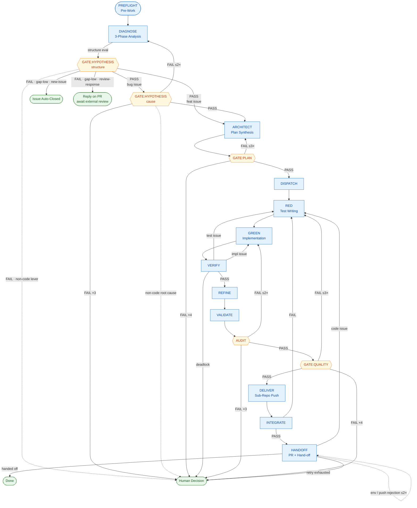

# AutoFlow Guide — Phase-by-Phase Development Lifecycle

> AutoFlow is a structured, evaluation-gated development lifecycle for AI-assisted
> software engineering with Claude Code. This guide is the **phase-body source of
> truth**: each phase's step-by-step procedure, scoring rubric, and `[MUST]`/`[DENY]`
> constraints live here. The cross-phase invariants, the router (phase list + Flow
> Control table), the regression / escalation caps, the Execution Principles, and the
> state schema live in [`CLAUDE.md`](../CLAUDE.md); the DIAGNOSE analysis procedure has
> its own playbook at [`phases/analysis.md`](phases/analysis.md).

---

## Overview

AutoFlow defines 16 phases (`PREFLIGHT` → `HANDOFF`) that guide every code change
from issue analysis to PR hand-off. Each phase has explicit entry/exit criteria, and
evaluation gates prevent low-quality work from reaching the PR. Merging is performed
by an external review process; AutoFlow does not merge.

Key principles:

- **No shortcuts** — every phase is executed in order.
- **Multi-agent separation** — distinct roles handle implementation, testing, and evaluation.
- **Bias prevention** — 3-phase independent analysis before coding.
- **Quantified quality** — 10-point evaluation with a defined PASS threshold.
- **Per-phase model selection** — teammate and subagent spawns use the recommended model per phase (`sonnet` for rubric-scored gates and classification work; `opus` for multi-turn design discussion, implementation, and self-check). Policy and table: [`CLAUDE.md`](../CLAUDE.md) > Spawn Model — Phase-by-Phase.

The phase names generalize upstream's numeric `STEP 0~9` identifiers; the
mapping is preserved 1:1 below.

| upstream | this guide |
|----------|------------|
| STEP 0 | PREFLIGHT |
| STEP 1 | DIAGNOSE |
| STEP 1.5 | GATE:HYPOTHESIS |
| STEP 2 | ARCHITECT |
| STEP 3 | GATE:PLAN |
| STEP 4 | DISPATCH |
| STEP 5a | RED |
| STEP 5b | GREEN |
| STEP 5c | VERIFY |
| STEP 5d | REFINE |
| STEP 5.5 | VALIDATE |
| STEP 5.7 | AUDIT |
| STEP 6 | GATE:QUALITY |
| STEP 7 | DELIVER |
| STEP 8 | INTEGRATE |
| STEP 9 | HANDOFF |

---

## Lifecycle Diagram

The full AutoFlow lifecycle, including regression paths and gate verdicts.
Diamond nodes are evaluation gates; stadium nodes are terminal states.



The same diagram in plain text, for environments without mermaid rendering:

```
PREFLIGHT
    │
    ▼
DIAGNOSE ─── structure eval ──► [FAIL]
                ├─ gap-item low (already satisfied) ─► new-issue: Issue Auto-Closed │ review-response: Reply on PR + await review
                └─ gap real, non-code lever ────────► report to user + pause
    │
    ▼
GATE:HYPOTHESIS (cause, bug only) ◄── retry ≤2×
    │
    ▼
ARCHITECT ◄── retry ≤3×
    │
    ▼
GATE:PLAN
    │
    ▼
DISPATCH → RED → GREEN ⇄ VERIFY (≤3 round-trips) → REFINE
                                                       │
                                                       ▼
                                                   VALIDATE
                                                       │
                                                       ▼
                                                    AUDIT  ◄── retry ≤2×
                                                       │
                                                       ▼
                                                GATE:QUALITY ◄── retry ≤3× → RED
                                                       │
                                                       ▼
                                                    DELIVER
                                                       │
                                                       ▼
                                                   INTEGRATE → [FAIL] → RED
                                                       │
                                                       ▼
                                                   HANDOFF ◄── retry ≤2×
                                                       │
                                                       ▼
                                          PR open — external review merges
```

---

## PREFLIGHT — Pre-Work

**Goal**: ensure a clean Git state before any analysis or coding begins.

| Step | Action |
|------|--------|
| 1 | `git status` — confirm no uncommitted changes or untracked files in the working area |
| 2 | `git fetch origin` — sync with remote |
| 3 | Resolve any dirty state (stash, commit, or discard with user approval) |
| 4 | `git checkout -b dev/YYYY-MM-DD main` — create a dev branch |

**Hard stop**: if the Git state is not clean after resolution attempts, **stop and report to the user**. Do NOT proceed to DIAGNOSE.

---

## DIAGNOSE — Issue Analysis

→ **Phase playbook (single source of truth): [`phases/analysis.md`](phases/analysis.md).**
Read it on entering DIAGNOSE. It carries the full procedure: the **intake readiness triage**
(`mode=new-issue` only, run ahead of the structure fan-out — a planning/design/ADR pre-req
filter that pauses for the user on FAIL, no auto issue creation), the 3-Phase independent
structure analysis (Phase A structure-only, Phase B issue-only, Phase 3 necessity scoring),
**the per-role document injection whitelist (three distinct roles — Phase A = current-state
area excerpts only; intake triage = issue body + readiness/work-type docs; Phase B = issue
body only)**, the issue-type classification (Type 1 code / Type 2 docs), the per-type scoring rubric and
PASS/FAIL thresholds (Type 1: each ≥ 7, two items; Type 2: each ≥ 7 and avg ≥ 7.5, three
items), the FAIL disposition by failing item and cycle `mode` (gap-low → new-issue close /
review-response reply on PR; non-code lever → report to user + pause), the review-response loop check (trigger repeats the prior cycle's complaint class with a new witness case → reply on PR + pause for the user), cause hypotheses
(≥ 3, "not a code bug" must be one), lightweight verification, hypothesis verdict notes,
task decomposition, affected-docs identification, and the structure- and confirmation-bias
safeguards.

---

## GATE:HYPOTHESIS — Hypothesis Evaluation (bug/incident issues only)

Feat issues skip this gate.

**Evaluator**: independent Evaluation AI, fresh-spawned per call.
**Input**: hypothesis list + lightweight-verification results + verdict notes.

### Scoring (3 items × 10 points)

| Item | Criterion |
|------|-----------|
| Hypothesis diversity | Are non-code causes (data, environment, already-fixed) sufficiently considered? |
| Verification sufficiency | Was lightweight verification actually performed? Are unverified items justified? |
| Verdict evidence | Is the conclusion (code change required / not required) logically supported? |

- **PASS** → ARCHITECT.
- **FAIL** → DIAGNOSE (max 2×). Two FAILs → human decision.
- **Non-code root cause confirmed** → report to user, pause AutoFlow.

---

## ARCHITECT — Plan Synthesis (Developer AI + Test AI)

Both perspectives participate, but the discussion runs inside an isolated
**`Workflow`** (the facilitator — `architect-deliberation`), **not** as Agent-Teams
teammates messaging the orchestrator: the Developer-AI and Test-AI run as in-script
sub-agents, their cross-talk stays in workflow variables, and only a single verdict
(`CONVERGED` + artifact paths, or `ESCALATE` at the 6-round cap) returns to the
orchestrator. The facilitator also appends the settled decisions to the decision
ledger. Rationale: [`CLAUDE.md`](../CLAUDE.md#deliberation-isolation-delegated-facilitation)
> Deliberation Isolation; contract: [`teammate-contracts.md`](teammate-contracts.md)
> Facilitator. The orchestrator invokes the facilitation workflow, then **verifies** the
returned verdict — spot-checking targeted artifact excerpts against re-derived facts (the
full read-and-score is GATE:PLAN's); it does not facilitate the discussion turn-by-turn and
does not receive the round-by-round messages.

**Document injection (ARCHITECT onward).** Past DIAGNOSE the Phase A ↔ Phase B isolation no longer applies — the Developer-AI and Test-AI both work from code and design together. Injection is still **role-minimal and routed via [`docs/INDEX.md`](INDEX.md)**, never wholesale: the facilitator passes each in-script sub-agent only the documents its design task needs (e.g. the project architecture overview, the in-scope ADR-candidate items, the relevant ADR records). **Deliberation Isolation is unchanged** — the round-by-round cross-talk stays inside the workflow and only the verdict returns to the orchestrator.

**Roles**:
- **Developer AI**: feature design (changed files, API interface, data structures).
- **Test AI**: verification design (acceptance criteria → verification method, testability assessment).

### Output artifacts

1. **Feature Design Document** (Developer-AI-led): files to change, API interface, data structures, dependencies.
2. **Verification Design Document** (Test-AI-led):

| Acceptance criterion | Verification type | Method |
|----------------------|-------------------|--------|
| (criterion 1) | automated | pytest / API test / etc. |
| (criterion 2) | manual    | scenario doc (delegated to user) |
| (criterion 3) | environment-dependent | introduce mock or propose design change |

- For untestable items: state the reason and the alternative (design change / manual delegation / mock).
- Design-change request: parts of the feature design that should be revised so they become testable.

### Testability-driven design

When the Test AI flags an item as "not automatable", the team discusses whether a feature-design change makes it testable. If not, the item stays as a manual scenario with a stated reason.

### Agreement criteria

Both documents reach ACCEPT from both teammates. The Discussion Protocol applies.
The facilitator records the converged decisions in the ledger and returns
`CONVERGED` + artifact paths; non-convergence within the round cap returns `ESCALATE`.

---

## GATE:PLAN — Plan Evaluation

**Evaluator**: fresh-spawned Evaluation AI.
**Input**: feature design + verification design from ARCHITECT.

### Scoring (5 items × 10 points)

| Item | Criterion |
|------|-----------|
| Feasibility   | Can this plan be implemented with the current structure? (grounded in the actual mechanisms, not a misread) |
| Dependencies  | Are affected files and side effects identified? |
| Scope         | Appropriate — not too broad, not missing requirements? (no redundant new mechanism where an extension suffices — over-engineering fails here) |
| Security      | Any security implications introduced? |
| Test plan     | Are acceptance criteria testable? |

`Feasibility` and `Scope` absorb the structural-fit concern that the DIAGNOSE structure gate deliberately does not score: a plan not grounded in the actual structure fails Feasibility; a plan that duplicates an existing mechanism or over-engineers a new one where an extension suffices fails Scope. This is where an actual design exists to judge it — DIAGNOSE only decides *whether* a code change is needed, GATE:PLAN judges *whether the plan fits*. By design this defers wrong-approach detection (e.g. a resolution targeting the wrong subsystem) past ARCHITECT: that judgment needs a design, so ARCHITECT's devil's-advocate is the first approach check and GATE:PLAN the gated one — DIAGNOSE cannot make it without re-introducing the altitude error of scoring feasibility before a design exists.

- **PASS** (avg ≥ 7.5, each ≥ 7) → DISPATCH.
- **FAIL** → ARCHITECT (max 3×).

---

## DISPATCH — Task Assignment

`TaskCreate` + `SendMessage` to **both teammates**:

- **Teammate spawn**: ARCHITECT ran as a self-contained `Workflow` that already returned (no persistent ARCHITECT teammates to shut down). At DISPATCH entry the orchestrator spawns fresh agents for RED/GREEN — see [`CLAUDE.md`](../CLAUDE.md) > Cost Control. Spawn prompts pass `.autoflow/*` paths only; discussion history is not carried over.
- **Test AI**: verification-design "automated" items → test-writing tasks.
- **Developer AI**: feature-design implementation tasks (**starts after RED is complete**).
- Both receive: acceptance criteria + verification design + affected docs.

---

## RED — Test Writing (Test First)

The Test AI writes test code from the verification design.

```
1. Convert acceptance criteria → test code (only items typed "automated").
2. Run tests → all must FAIL (Red).
   - A test that does not fail means the criterion is already met or the test is wrong → investigate.
3. For untestable items → write a manual verification scenario document.
4. Hand the test code + scenario document to the Developer AI.
```

**Completion**: all automated tests Red + manual scenarios written.

---

## GREEN — Implementation

The Developer AI writes the minimum code that passes the tests.

```
1. Read the test code authored by the Test AI.
2. Write the minimum code that passes the tests.
   - [MUST] Do NOT implement behavior not covered by tests.
   - [MUST] Stay on the change surface defined in the plan — see [`submodule-common-rules.md`](submodule-common-rules.md) > Change Surface Rules.
   - [MUST] Tests verify correctness; they do not define the solution. Implement the actual logic that solves the problem for all valid inputs — never hard-code to the test inputs, special-case the assertions, or add workaround/helper scripts just to turn a test green. "Minimum code" means the smallest *general* implementation that satisfies the AC, not the narrowest path that satisfies the assertions. If a test looks wrong or infeasible, raise it as a VERIFY cause-branch rather than coding around it.
3. Commit (feat/fix branch).
```

---

## VERIFY — Test Run + Verification

Run the tests; on failure, branch by cause.

```
1. Run all tests.
2. Branch on result:
   All PASS → step 3.
   Some FAIL → cause branching (run under delegated facilitation — the `verify-cause-branch` workflow returns a single
   next_action — RED | GREEN | SEQUENTIAL_FIX | EVALUATION_AI — and the orchestrator
   routes on it; it never sees the round-by-round exchange; see [`CLAUDE.md`](../CLAUDE.md) > Deliberation Isolation):
     The workflow hands the failure log + test code + implementation code to both AIs.
     Test AI:      "Does my test accurately reflect the acceptance criterion?" — self-check.
     Developer AI: "Does my implementation meet the acceptance criterion?"     — self-check.
       ├─ fix_test + no_problem → RED            → fix test → re-confirm Red → re-enter GREEN
       ├─ no_problem + fix_impl → GREEN          → fix implementation → re-run VERIFY
       ├─ fix_test + fix_impl   → SEQUENTIAL_FIX → fix test first → Red → fix impl → Green
       ├─ no_problem + no_problem → EVALUATION_AI → deadlock: Evaluation AI judges against acceptance criteria
       └─ a missing/errored self-check → EVALUATION_AI (recorded as "missing", never as no_problem)
3. Minimal-implementation check (Test AI):
   diff analysis: are there parts of the impl diff not covered by any test?
     ├─ All covered → PASS
     ├─ Uncovered code → ask Developer AI to remove it, or add a test
     └─ Infrastructure / config / non-testable code → exception allowed (state reason)
```

**Deadlock resolution**: Evaluation AI judges against the acceptance criteria as the objective baseline.
**Max round-trips**: GREEN ↔ VERIFY max 3. After 3 unresolved → human.

---

## REFINE — Refactor (Green maintained)

```
1. Developer AI: run /simplify
   - Three parallel agents (reuse / quality / efficiency).
   - Apply suggested fixes (no behavior change — tests must pass without modification).
   - If /simplify finds nothing, proceed to step 2 (do NOT skip).
2. [MUST] Re-run all tests → confirm Green.
   - Run even when step 1 made no changes.
   - On FAIL → revert /simplify changes → Developer AI fixes (max 2×).
3. Commit (refactor type; skip if step 1 made no changes).
```

**Why /simplify?** Removes the AI's "nothing to clean up" skip bias.
**Max retries**: 2; on second failure, abandon refactor and proceed to VALIDATE
with the Green state from VERIFY.

---

## VALIDATE — Verification Done

```
1. Automated tests: all PASS confirmed (achieved in VERIFY).
2. Minimal-implementation check: PASS confirmed (achieved in VERIFY step 3).
3. Manual checklist: list the manual scenarios from the Test AI (mark "delegated to user").
4. Maintained-docs check: confirm impacted docs are updated.
```

**Verdict**: automated tests all PASS + minimal-implementation PASS + manual scenarios listed. Manual items marked "delegated to user" do not block VALIDATE.

---

## AUDIT — Security Audit (independent evaluation)

After VALIDATE, run a project-specific security audit on the change. Complements
GATE:QUALITY's `Security` item with 5 dedicated, project-specific items.

**Evaluator**: fresh-spawned Evaluation AI.
**Input**: change diff + the project-specific security checklist
(`docs/security-checklist.md`).

### Scoring (5 items × 10 points)

Items adapt to the project's threat surface; defaults below.

| Item | Criterion |
|------|-----------|
| Authn/Authz       | Are auth flows on changed endpoints complete? |
| Input validation  | Are external inputs (queries, parameters, payloads) validated/escaped? |
| Data exposure     | Are tokens / passwords / PII kept out of logs and responses? |
| Infra isolation   | Are internal ports/services not exposed externally? |
| Dependencies      | No known vulnerabilities in changed external dependencies? |

- **PASS** (avg ≥ 7.5, each ≥ 7, security ≤ 3 → immediate block) → GATE:QUALITY.
- **FAIL** → fix, re-evaluate (max 2×). Two FAILs → human.

GATE:QUALITY's `Security` item references the AUDIT result to avoid duplicate work.

---

## GATE:QUALITY — Completion Evaluation

**Evaluator**: fresh-spawned Evaluation AI.
**Input**: full change set + test results + AUDIT result.

### Scoring (10 items × 10 points)

Completeness, Quality, Test coverage, Test quality, Security (references AUDIT),
Fit, Impact scope, Minimal implementation, Commit conventions, Doc updates.

The `Minimal implementation` item is scored against [`submodule-common-rules.md`](submodule-common-rules.md) > Change Surface Rules: a diff with hunks that do not trace to an AC fails this item regardless of code quality.

- **PASS** (avg ≥ 7.5, each ≥ 7, security ≤ 3 → block) → DELIVER.
- **FAIL** → RED (max 3×).

---

## DELIVER — Sub-Repo Push

```
1. Each Submodule AI pushes its branch to its fork (`git push origin <branch>`).
2. Teammate shutdown — Submodule AIs report completion and stop.
3. The host's dev branch is NOT pushed yet (that happens at HANDOFF, when the host PR is created).
```

In single-repo deployments, DELIVER reduces to a single `git push -u origin <branch>` and the Developer AI shuts down.

---

## INTEGRATE — Integration Verification

```
1. Build all affected sub-repos in dev (e.g., docker compose -f docker-compose.dev.yml up -d --build <services>).
2. Health checks pass for each service.
3. Functional integration tests pass.
4. Cross-cutting concerns (auth, network ingress, etc.) verified.
```

In single-repo deployments, INTEGRATE runs the project-level integration test
suite (or a smoke test). Projects with no integration layer report "INTEGRATE:
no-op (single-repo / no integration suite)" — this is a registry-driven no-op,
not a discretionary skip.

**Failure**: INTEGRATE FAIL → RED (existing GREEN↔VERIFY round-trip rules apply).

---

## HANDOFF — PR Creation + Hand-off

AutoFlow's mission ends by handing off an open PR — after PR creation, CI, the automated PR review, and resolved review triage (step 6.5). Merging, issue close, and deployment are outside AutoFlow's authority, performed entirely by an external review process that AutoFlow does not define or perform.

```
1. Change summary (changed files, commit hashes; per-sub-repo if applicable).
2. Test results report.
3. Push the dev branch: `git push -u origin dev/<branch>` (in a review-response cycle the branch is already tracked; the push updates the existing PR).
4. Create PR(s) (skipped in a review-response cycle — step 3's push updates the existing PR):
   - PR title and body follow the repository's title / PR-body conventions (see git-workflow.md > Pull Request Process).
   - Sub-repo changes present:
     a. Create each sub-repo PR (fork → upstream) with the `blocked-by-review` label, body `Part of {{GITHUB_ORG}}/{{REPO_ORCHESTRATOR}}#N` (no close keyword). The review gate is per-PR: every PR created for this cycle — the host PR and each sub-repo PR — carries `blocked-by-review` and is reviewed on its own diff in step 6. The `blocked-by-review` label must exist in each repo (one-time operator setup — see external-review-sequencing.md). `blocked-by-subrepo` is a separate, host-only merge-order gate, not a review gate.
     b. Create the host PR as a draft with the `blocked-by-review` gate label (cleared by the review in step 6 when clean) and, for multi-repo changes, the `blocked-by-subrepo` label. The body is the rendered host PR body (see PR Issue Auto-Close in git-workflow.md).
   - Host-only change (no sub-repo dependency): create the host PR as a draft with the `blocked-by-review` gate label but no `blocked-by-subrepo` label, and unblock the host-only merge-order check per external-review-sequencing.md > host-only case.
5. Confirm CI is green on the created PR(s).
6. Post-PR automated review (per-PR): run the external automated PR reviewer (e.g. Codex) on every PR created in step 4 — the host PR and each sub-repo PR — each reviewed against its own diff. The reviewer posts a severity-ranked review comment to each PR and removes that PR's `blocked-by-review` gate label when its review finds zero Critical/High/Medium findings, leaving it in place otherwise. The reviewer does not approve / request-changes, merge, or close. A sub-repo PR review is required, not optional — for a multi-repo change the host PR diff is only the submodule-pointer bump, so reviewing the host alone never covers the sub-repo code. In a review-response cycle the review re-runs per-PR against each PR still carrying the gate label.
6.5. Review triage (per-PR; after step 6, before termination). For each PR, read two signals: the `blocked-by-review` label state (`gh pr view <N> --json labels`) and the review verdict. Per Cost Control, the orchestrator does not read the review comment body itself; a `sonnet` subagent ingests it (`gh pr view <N> --comments`), writes severity-classified findings to `.autoflow/issue-{N}-review-findings.md`, and returns `{max_severity, findings, low_confidence_items}` + the label state. The verdict (`max_severity`) is the primary signal; the label is a derived, fail-open-prone signal — the two can disagree because a clean review may still leave the label on if removal fails. Branch on the pair:
   - max_severity ≥ Medium (the reviewer confirmed Critical/High/Medium) — do NOT end. Auto-enter a review-response cycle in-session with the review comment as the DIAGNOSE trigger, reusing the existing review-response machinery (re-running DIAGNOSE → … → HANDOFF on the flagged findings and re-running step 6 on the PRs still carrying the label). The label is cleared only by the re-review — the orchestrator never removes it. Each auto-triggered review-response entry is recorded in `.autoflow/issue-{N}-ledger.md` with a `review-autofix` marker.
     - Pause for the user (`AskUserQuestion`; `active:false`) when the attempt hits any of: (a) the fix needs a contract / acceptance-criterion change, (b) the fix direction is ambiguous, (c) the finding is a Low Confidence item, (d) the attempt repeats the immediately-prior review-response cycle's complaint class with a new witness case (loop-check match). The user's answer is appended to the ledger and selects re-entry.
     - Attempt cap = 7. Count this issue's `review-autofix`-marked ledger entries; on the 7th without the label clearing, stop auto-resolving and pause for the user (`active:false`).
   - Label present but max_severity < Medium (or no verdict determinable) — this is NOT a code finding; the review was clean yet the label stuck (a label-removal / review-infrastructure failure). Do NOT start a review-response cycle (there is nothing to fix). Re-run the step-6 review on that PR so the re-review clears the label; if it still sticks, escalate to the user / operator (`active:false`). This path does NOT consume the 7-attempt code-resolution cap.
   - No label and max_severity = Low — the orchestrator decides by pure agent judgment (no fixed rule) whether any Low finding is worth fixing now: yes → run the same in-session review-response resolution for those items (Low alone does not trigger a user pause unless one of the 4 criteria above is hit); no → proceed to step 7, optionally leaving a one-line PR note that the Low items were reviewed and deferred.
   - No label and no findings — proceed directly to step 7.
7. `.autoflow/issue-{N}.json` (only once review triage is resolved — no PR retains `blocked-by-review`): set `active` to `false`; remove the in-progress label from the issue (`gh issue edit #N --remove-label "status:in-progress"`).
8. Report: "PR #N open (draft) — review posted — handed to external review." AutoFlow ends; the session may terminate.
```

**[MUST]** AutoFlow runs neither `gh pr merge` nor a push to the default branch. Merging — including, for multi-repo changes, the sub-repo → pointer → host sequencing — is owned entirely by the external review process. Submodule pointer reconciliation defaults to the operator but may be delegated to AutoFlow on explicit request after the sub-repo PR is merged upstream.

**[MUST]** The host PR body uses `Closes #N` so the external merge closes the issue automatically. Sub-repo PR bodies use `Part of {{GITHUB_ORG}}/{{REPO_ORCHESTRATOR}}#N` and omit `Closes`.

Topology decides which PRs HANDOFF creates (see [`CLAUDE.md`](../CLAUDE.md) > Deployment Topology): a project with one or more submodules creates each affected sub-repo PR plus the host PR; change scope determines which sub-repo PRs exist. In single-repo deployments (zero submodules), HANDOFF creates one host PR with `Closes #N`.

Dev-branch deletion and removal of the resolved issue's `.autoflow/issue-{N}*` management files follow the external merge or rejection, handled by the next cycle's PREFLIGHT cleanup. The durable record lives in the GitHub PR/issue and commit log (the `.autoflow` files are gitignored scratch).

### HANDOFF failure → regression

Classify the cause and regress along the matching path.

```
PR creation / CI (steps 3-5) failure:
  CI failure (code issue)      → RED (test/impl fix, existing rules apply)
  CI failure (env / transient) → CI retry, then step 5 retry (max 2)
  Push rejected (branch state)  → dev branch rebase on main → step 3 retry (max 2)
```

**Max retries**: HANDOFF internal retry max 2. Two failures → human.
**RED regression**: existing GREEN↔VERIFY round-trip rules (max 3) apply.

### Merge Sequencing (external review)

AutoFlow opens the host PR as a draft with the `blocked-by-subrepo` label; the external reviewer performs the merge in this order — (1) merge each sub-repo PR into its upstream default branch, (2) reconcile the host PR's submodule pointer to the upstream merge commit, (3) signal the host repo that the sub-repo merge is done (unblocking the host merge-order check), (4) promote the host PR draft → ready, (5) merge the host PR (its `Closes #N` line closes the issue). The full reviewer-facing procedure, dispatch payload schema, and concurrent-cycle pointer-reconciliation guard live in [`external-review-sequencing.md`](external-review-sequencing.md) and [`git-workflow.md`](git-workflow.md) > Merge Sequencing.

**Host-only case**: there is no sub-repo step; the host merge-order check is unblocked at PR creation, and the reviewer performs only the promote + merge steps.

**[MUST]** AutoFlow does not merge, promote the draft to ready, or merge the sub-repo PRs. It only creates the draft PR(s) at HANDOFF. Pointer reconciliation may be delegated to AutoFlow on explicit request after the sub-repo PR is merged.

---

## Execution Principles

→ Single source of truth: [`CLAUDE.md`](../CLAUDE.md) > Execution Principles. These are
always-on orchestrator invariants (not phase-local), so they stay resident in the core
file: Safety first, Verify before transition, Every phase is mandatory, Teammate idle
handling, **Verify teammate claims before dispatch** (every report's Evidence anchor is
verified before ACCEPT — an anchor-less report is rejected, not interpreted), and Stop on
error.

---

## See Also

- [`CLAUDE.md`](../CLAUDE.md) — cross-phase invariants, the router (phase list + Flow Control), regression caps, Execution Principles, state schema.
- [`phases/analysis.md`](phases/analysis.md) — DIAGNOSE analysis procedure (3-Phase A/B/3, scoring rubric, bias prevention).
- [`design-rationale.md`](design-rationale.md) — why every rule exists.
- [`evaluation-system.md`](evaluation-system.md) — scoring and PASS thresholds.
- [`submodule-common-rules.md`](submodule-common-rules.md) — Discussion Protocol, sub-repo rules.
- [`repo-boundary-rules.md`](repo-boundary-rules.md) — cross-repo coordination.
- [`git-workflow.md`](git-workflow.md) — bash procedures, branch structure.
